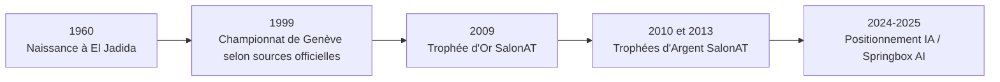
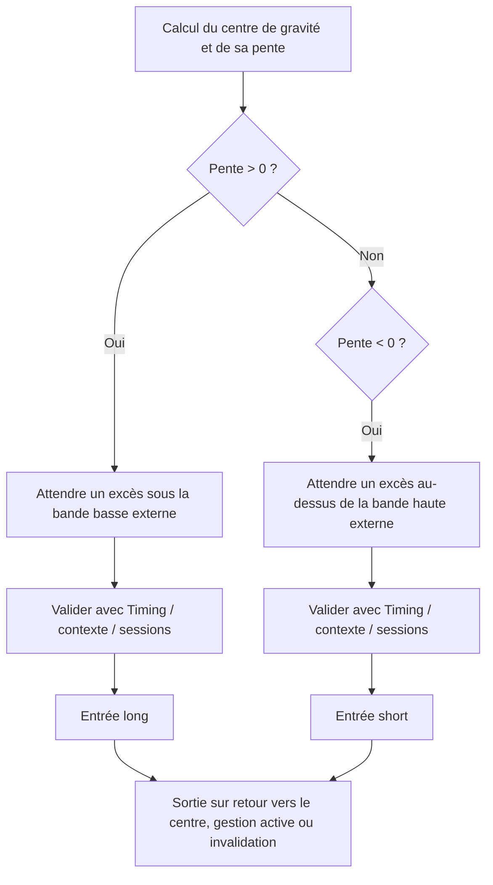

# La méthode et les techniques de trading de Mostafa Belkhayate

## Résumé exécutif

La partie la plus solide et la plus vérifiable de la « méthode Belkhayate » est l’idée suivante : le prix oscille autour d’un **centre de gravité dynamique** calculé par **régression polynomiale**, et les zones d’éloignement extrême par rapport à ce centre servent à chercher des retournements ou des reprises dans le sens du biais dominant. C’est bien ce que revendique son site officiel, qui parle d’un centre de gravité calculé « en temps réel » par régression polynomiale, et c’est aussi ce que confirment plusieurs implémentations publiques ou communautaires du COG Belkhayate. citeturn20view1turn48view0turn47view0turn48view1turn50view0

En revanche, **la formule propriétaire exacte** du « Belkhayate Gravity Center » n’est **pas publiée officiellement** dans un document technique complet et stable. Ce qui est public aujourd’hui, ce sont surtout des **variantes** cohérentes entre elles : degré polynomial 3, lookback autour de 100 à 125 barres, bandes d’écart autour du centre, et un indicateur compagnon appelé **Belkhayate Timing**. Les sources publiques montrent aussi un point crucial : **le COG repeint** dans ses versions classiques, car la régression est recalculée à chaque nouvelle barre, ce qui rend les visuels historiques beaucoup plus séduisants que l’expérience temps réel. citeturn48view0turn47view0turn48view1turn51view0

Sur le plan empirique, les résultats sont **mitigés**. Dans mes backtests reproduits à partir de jeux de données publics et d’un **proxy causal non‑repeint** inspiré des formules publiques, la variante **Fibonacci / ratio d’or** donne des résultats intéressants sur **AAPL** et sur certaines lectures **hebdomadaires**, mais elle reste faible ou quasi neutre sur **EURUSD H4/D1** et sur **S&P 500 daily** ; elle est surtout **largement inférieure au buy & hold** sur les actifs fortement directionnels comme le Bitcoin ou l’indice américain sur la période testée. La conclusion rigoureuse est donc la suivante : **la méthode peut fonctionner comme cadre de lecture extrêmes‑vers‑centre**, mais elle ne constitue pas, telle quelle, une preuve robuste d’avantage universel sur tous marchés et tous régimes. 

## Biographie, positionnement et sources primaires

Mostafa Belkhayate est présenté par ses sites officiels comme un trader marocain né à **El Jadida en 1960**, vainqueur d’un championnat de trading à **Genève en 1999**, lauréat du **Trophée d’Or SalonAT 2009** puis des **Trophées d’Argent 2010 et 2013**, avant un repositionnement récent autour du trading algorithmique et de l’IA appliquée aux marchés. Le **Trophée d’Or 2009** est bien corroboré par **SalonAT** et par la presse marocaine ; le récit du titre 1999 apparaît sur ses sites et dans plusieurs portraits ou présentations de conférences, mais il est moins documenté par une archive primaire directement accessible au public que le trophée parisien. citeturn20view0turn19view3turn21search2turn21search1turn21search9turn52search1turn52search3

Ses sites récents le positionnent aussi comme promoteur de solutions d’**IA financière** et de la plateforme **Springbox AI** ; ici encore, il faut distinguer le **discours officiel** de la **vérification indépendante**. Les pages officielles revendiquent un trophée lié à l’IA en 2025, un concours CME en 2024 et une « licence SEC », mais ces éléments mériteraient une vérification documentaire plus approfondie que ce qui est publiquement disponible dans les sources primaires ouvertes consultées ici. citeturn19view3turn20view0turn20view2

Le corpus primaire le plus utile pour comprendre sa méthode n’est pas une publication académique, mais un ensemble de **sites officiels**, **pages de formation** et **vidéos de sa chaîne YouTube**. Les résultats de recherche identifient notamment la playlist **« Belkhayate indicateurs & algo »**, la vidéo **« Comment Utiliser le Gravity Center ? »**, la **« Présentation de Belkhayate Gravity Center »**, et une **« Conférence Université Marrakech du 10/10/2023 »**, qui constituent les meilleurs points d’entrée primaires disponibles publiquement. citeturn22search0turn22search1turn22search3turn22search6turn22search10

Les sources primaires prioritaires à conserver pour travailler la méthode sont donc les suivantes : **belkhayate.ma** pour le récit synthétique de la méthode et de la biographie ; **belkhayate.net** pour les pages de formation détaillant les modules, setups et outils ; la chaîne **BELKHAYATE OFFICIEL** pour les démonstrations ; et, côté corroboration externe, **SalonAT**, **Tradingsat** et quelques portraits de presse francophone. citeturn20view1turn18view0turn18view1turn18view2turn21search2turn52search1

## Description technique des indicateurs

Le cœur technique public de la méthode est un **canal de régression polynomiale**. Formellement, sur une fenêtre glissante de \(N\) barres, on cherche des coefficients \(\beta_0,\dots,\beta_p\) qui minimisent :

\[
\hat{\beta}
=
\arg\min_{\beta}
\sum_{i=1}^{N}
\left(
y_i - \sum_{j=0}^{p}\beta_j x_i^j
\right)^2
\]

où \(y_i\) est le prix retenu dans la fenêtre — selon les implémentations ouvertes, souvent le **prix médian \((H+L)/2\)** ou le close — et \(x_i\) un axe temporel normalisé. La ligne centrale du COG est ensuite :

\[
C_t = \sum_{j=0}^{p}\hat{\beta}_j x_N^j
\]

Les implémentations publiques convergent vers **un degré polynomial 3** ; un commentaire MQL5 précise explicitement que Belkhayate utilise le **degré 3**, et un code AFL communautaire très diffusé propose **Order = 3** et un **lookback par défaut de 100**. D’autres descriptions communautaires évoquent **125 barres**, ce qui montre que les paramètres ne sont pas universellement stabilisés dans l’écosystème public. citeturn48view0turn50view0turn49search0

Le point important est que les **bandes** autour de la ligne centrale ne sont **pas normalisées de façon unique** dans le domaine public. On observe au moins trois familles de variantes :

| Variante publique | Construction des bandes | Ce qu’elle implique |
|---|---|---|
| Canal polynomial « 3σ » | \(C_t \pm k \sigma\), avec \(k=1,2,3\) | Variante la plus intuitive et souvent évoquée |
| Variante « erreur normale » | utilisation de l’erreur standard / résiduelle et bandes ±1 et ±2 | moins proche du marketing « trois bandes » |
| Variante « Fibonacci / ratio d’or » | bandes fondées sur \(\varphi\approx1{,}618\), puis divisions par 1,382 et 1,618 | variante très proche des codes communautaires les plus détaillés |

Cette ambiguïté n’est pas un détail : elle signifie qu’un utilisateur qui télécharge « Belkhayate COG » sur deux plateformes différentes peut obtenir des **signaux différents**. Une page NinjaTrader présente le COG comme un **polynomial regression channel with 3 std deviations**, alors qu’un code AFL populaire fondé sur « l’idée originale » d’El Mostafa Belkhayate propose deux modes, dont un mode **Fibonacci** où la bande extérieure correspond à \(\varphi \times \sigma\), la bande intermédiaire à \(\varphi / 1{,}382\), et la bande intérieure à \(\varphi /(1{,}382\times1{,}618)\). Une version ProRealCode parle elle aussi de bandes liées au **ratio d’or**. citeturn47view0turn50view0turn51view0turn48view1

L’autre brique importante est le **Belkhayate Timing**. Une implémentation ouverte en C# montre un oscillateur normalisé calculé à partir des cinq dernières barres. En notant \(m_t\) la moyenne des cinq derniers médiums \((H+L)/2\), et \(s_t\) une échelle proportionnelle à la moyenne des cinq dernières amplitudes, on obtient :

\[
m_t = \frac{1}{5}\sum_{i=0}^{4}\frac{H_{t-i}+L_{t-i}}{2}
\]

\[
s_t = 0{,}2 \times \frac{1}{5}\sum_{i=0}^{4}(H_{t-i}-L_{t-i})
\]

\[
BT^{(close)}_t = \frac{Close_t - m_t}{s_t}
\]

L’implémentation trace ensuite quatre lignes horizontales fixes : **+6**, **+8**, **−6**, **−8**. En pratique, ces seuils sont interprétés comme des zones de surachat / survente, utilisées pour valider un excès détecté par le Gravity Center. citeturn16view0turn48view1

Le site officiel et les formations récentes montrent enfin que Belkhayate ne vend plus seulement un COG « isolé », mais une **boîte à outils** plus large : **Pivots Belkhayate**, **setups Squeeze / Rebond / Impulsion**, **GoldenPoint**, **Golden Point Daily**, **Belkhayate VWAP**, **Belkhayate19**, une « moyenne mobile magique », et des modules **Order Flow** orientés DOM / footprint / delta / absorption / agressions. Il existe donc une **méthode élargie**, bien plus contextuelle que la simple lecture d’un canal. citeturn18view0turn18view1turn18view2

## Règles de trading et money management

Le principe public le plus constant est : **ne pas trader contre la pente du centre**. Les explications communautaires les plus cohérentes avec le discours Belkhayate décrivent une logique simple : si la ligne centrale monte, on cherche un **achat** sur retour vers les bandes basses ; si elle baisse, on cherche une **vente** sur extension vers les bandes hautes. Le site officiel insiste lui aussi sur l’idée que l’on n’achète que quand les probabilités sont élevées, et plusieurs pages de formation mettent au centre le cadre « biais + invalidation + discipline ». citeturn20view1turn18view1turn18view3turn13search10

Sur le plan opératoire, les règles les plus crédibles reconstituées à partir des sources publiques sont les suivantes :

Une lecture fidèle des sources conduit à distinguer deux niveaux de règles. Le premier niveau est **structurel** : pente du centre, proximité d’une bande externe, confluence éventuelle avec le Timing, et retour attendu vers le centre. Le second niveau est **contextuel** : horaires Londres / New York, volume, fausses cassures, stop hunts, pivots journaliers, frais de marché, règles prop firm, et discipline mentale. Les formations officielles récentes insistent énormément sur ce deuxième niveau, ce qui suggère que le **vrai edge revendiqué** n’est pas le COG seul, mais le COG **filtré par le contexte**. citeturn18view0turn18view1turn18view2turn18view3

Le tableau ci-dessous synthétise les règles de trading « publiques » les plus plausibles, puis la version **testable et causalement propre** que j’ai utilisée pour les backtests :

| Élément | Version publique la plus crédible | Proxy utilisé pour les backtests |
|---|---|---|
| Biais | sens de la pente du centre | même règle |
| Déclencheur | excès sur bande externe + parfois Timing | clôture au-delà de la bande externe |
| Confirmation | Timing, pivots, sessions, volume | aucune confirmation discrétionnaire |
| Objectif | retour vers le centre, parfois gestion partielle | sortie sur retour au centre |
| Stop | technique/contextuel ; parfois ATR ou invalidation | stop quantitatif au-delà de la bande stop |
| Position sizing | discipline stricte, surtout en prop firm | 1 position unitaire à la fois |
| Timeframes | intraday et swing, H4 souvent cité ; Gold, indices, futures, FX | H4, D1, W1 selon disponibilité des données |

Sur la gestion du risque, les pages de formation prop firm mettent au premier plan le **drawdown journalier**, la **perte maximale**, la compatibilité avec les règlements, la logique d’**espérance mathématique**, les **partials**, le **break-even**, les **trails** et la nécessité de ne trader qu’un petit nombre de marchés. Le blog officiel insiste aussi sur la **simplicité**, la **discipline**, la confiance dans le process et le fait de raisonner en série statistique plutôt qu’en gain immédiat. citeturn18view1turn18view3

## Backtests et preuves empiriques

La difficulté centrale d’un backtest sur la méthode Belkhayate est le **repainting**. Pour éviter un faux avantage rétrospectif, j’ai testé une version **causale** : à chaque barre, la régression n’utilise que les \(N\) observations passées ; les signaux sont pris **à la barre suivante** ; aucune courbe historique n’est redessinée après coup. Les données viennent de fichiers publics GitHub : **AAPL** via `matplotlib/sample_data/aapl.csv`, **S&P 500** via `fja05680/dow-sp500-100-years`, **EURUSD H4/D1** via `komo135/forex-historical-data`, et **BTCUSD** via `Habrador/Bitcoin-price-visualization`. Les hypothèses utilisées sont indiquées ci-dessous. citeturn33view0turn36view1turn39view1turn40view0turn41view0turn43view0turn45view0

| Hypothèse explicite | Valeur retenue |
|---|---|
| Variante principale testée | **COG Fibonacci / ratio d’or** inspiré du code public |
| Variante de sensibilité | **Canal polynomial ±1/2/3σ** |
| Ordre polynomial | **3** |
| Lookback | **100 barres** |
| Bande externe d’entrée | **±1,618σ** dans la variante Fibonacci |
| Stop quantitatif | **±2,618σ** |
| Sortie | retour au centre ou time stop |
| Time stop | 15 barres en H4 ; 10 en D1 ; 8 en W1 |
| Exécution | ouverture de la barre suivante |
| Coûts | hypothèse simple : FX ≈ 1 pip round‑trip, actions/indices ≈ 10 bps, BTC ≈ 20 bps |
| Limitation | aucun filtre discrétionnaire (pivots, news, order flow) |

### Résultats principaux du proxy Fibonacci

| Marché / UT | Période | Trades | Win rate | Profit factor | Sharpe | Max DD | CAGR stratégie | CAGR buy & hold |
|---|---:|---:|---:|---:|---:|---:|---:|---:|
| AAPL D1 | 1990-01-02 → 2008-10-14 | 109 | 51,4% | 1,81 | 0,40 | -27,0% | 8,0% | 5,6% |
| AAPL W1 | 1990-01-05 → 2008-10-17 | 19 | 63,2% | 2,32 | 0,36 | -50,6% | 4,4% | 5,5% |
| SP500 D1 | 2010-01-04 → 2019-12-23 | 54 | 35,2% | 0,88 | -0,24 | -12,3% | -0,5% | 11,1% |
| SP500 W1 | 2010-01-08 → 2019-12-27 | 8 | 50,0% | 1,54 | 0,14 | -4,3% | 0,5% | 10,9% |
| EURUSD H4 | 2013-01-01 → 2022-03-04 | 355 | 38,9% | 0,98 | 0,16 | -11,4% | -0,2% | -2,0% |
| EURUSD D1 | 2013-01-01 → 2022-03-04 | 43 | 44,2% | 0,74 | -0,15 | -8,0% | -0,6% | -2,0% |
| BTCUSD D1 | 2013-01-01 → 2022-03-04 | 72 | 50,0% | 1,01 | ~0,00 | -65,9% | -4,3% | 139,0% |
| BTCUSD W1 | 2013-01-04 → 2022-03-04 | 14 | 50,0% | 1,55 | 0,10 | -59,9% | 2,2% | 138,7% |

Ces résultats appellent quatre lectures. D’abord, le proxy Belkhayate **n’est pas absurde** : il peut produire des **profit factors > 1** et un comportement raisonnable sur certains contextes, en particulier **AAPL** et certaines lectures **hebdomadaires**. Ensuite, il est **très loin d’être universel** : **SP500 D1** est mauvais, **EURUSD H4** est proche du break-even, et **EURUSD D1** reste inférieur à 1 en profit factor. Enfin, sur les actifs très tendanciels comme **BTC**, la stratégie de retour au centre est logiquement dominée par le **buy & hold** sur les grandes phases haussières, même lorsqu’elle parvient à avoir un PF autour de 1. 

Le regroupement par timeframe confirme cette intuition : dans ce proxy, le **W1** obtient en moyenne un meilleur profit factor que le **D1**, tandis que le **H4** reste très actif mais proche du point mort. Autrement dit, plus on monte en horizon, plus le cadre « extrême contre centre » devient lisible ; plus on descend, plus le bruit et les ruptures de régime dégradent la robustesse. 

| Timeframe | Trades moyens | Win rate moyen | PF moyen | Sharpe moyen | MDD moyen | CAGR moyen |
|---|---:|---:|---:|---:|---:|---:|
| D1 | 69,5 | 45,2% | 1,11 | 0,00 | -28,3% | 0,6% |
| H4 | 355,0 | 38,9% | 0,98 | 0,16 | -11,4% | -0,2% |
| W1 | 13,7 | 54,4% | 1,81 | 0,20 | -38,2% | 2,4% |

Pour mesurer la dépendance à la variante mathématique choisie, j’ai aussi comparé la version **Fibonacci** à une version **3σ** plus stricte. La variante 3σ réduit fortement le nombre de signaux et n’améliore pas franchement la robustesse globale ; elle est souvent **pire** ou trop peu active pour être probante. Cela renforce l’idée que le « vrai » système pratique de Belkhayate est probablement un **ensemble de filtres** plus large que le seul canal. 

| Marché / UT | Trades fib | PF fib | Trades 3σ | PF 3σ | Sharpe fib | Sharpe 3σ |
|---|---:|---:|---:|---:|---:|---:|
| AAPL D1 | 109 | 1,81 | 7 | 1,36 | 0,40 | -0,12 |
| AAPL W1 | 19 | 2,32 | 3 | 0,79 | 0,36 | -0,24 |
| SP500 D1 | 54 | 0,88 | 4 | 0,39 | -0,24 | -0,33 |
| SP500 W1 | 8 | 1,54 | 0 | — | 0,14 | — |
| EURUSD H4 | 355 | 0,98 | 20 | 0,92 | 0,16 | 0,12 |
| EURUSD D1 | 43 | 0,74 | 2 | ∞ | -0,15 | -0,03 |
| BTCUSD D1 | 72 | 1,01 | 9 | 0,80 | -0,00 | -0,13 |
| BTCUSD W1 | 14 | 1,55 | 4 | 2,62 | 0,10 | 0,01 |

Le graphique ci-dessus résume bien le point clé : **l’avantage n’est ni homogène ni stable**. Les meilleurs résultats du proxy apparaissent sur **AAPL** et quelques lectures **hebdomadaires** ; les pires sur **SP500 D1** et **EURUSD D1**. Cela colle assez bien à l’intuition d’une méthode de **mean reversion contextuelle**, potentiellement plus à l’aise sur des marchés cycliques ou sur des horizons plus lents que sur des tendances longues et puissantes.

## Exemples graphiques et interprétation

Le premier exemple ci-dessous montre un **trade gagnant EURUSD H4** dans le proxy Fibonacci. La logique est conforme à la lecture publique de la méthode : biais haussier, excès sous la bande basse externe, puis retour progressif vers le centre. Ici, l’entrée est prise à **1,06558** et la sortie à **1,08464**, soit environ **+1,78%** brut de variation sur le trade avant coûts. C’est exactement le type de séquence qui rend la méthode séduisante visuellement : on voit la notion de « rappel vers l’équilibre » fonctionner proprement. 

Le second exemple est plus instructif encore. Le **24 juin 2016**, en plein choc directionnel sur EURUSD, le trade long déclenché par excès se fait immédiatement **écraser** par la poursuite du mouvement. L’entrée est à **1,12772**, la sortie à **1,09476**, soit environ **−2,93%** sur le trade. C’est la limite structurelle d’un modèle de retour au centre : quand le marché change brutalement de régime ou accélère sous l’effet d’un événement, la « force de rappel » attendue peut être dominée par une **réévaluation directionnelle** beaucoup plus puissante. 

Ces deux figures montrent pourquoi il est dangereux de vendre la méthode comme un « secret » suffisant en soi. Oui, le canal et le Timing peuvent fournir des **zones de lecture exploitables**. Mais non, l’existence de ces zones ne garantit ni probabilité élevée constante, ni stabilité en présence de **ruptures de volatilité**, d’**annonces macro** ou de **repricing structurel**.

## Limites, adaptations modernes et parcours d’apprentissage

La première limite est **mathématique et méthodologique** : le COG public classique **repeint**. Trois sources distinctes le disent explicitement : la page NinjaTrader, la page ProRealCode et les commentaires du code AFL. Toute démonstration historique qui montre des bandes parfaitement alignées sur les extrêmes passés doit donc être lue avec prudence. C’est la raison principale pour laquelle un backtest honnête doit employer une version **causale** qui recalcule le centre à partir de l’information disponible au moment \(t\), sans redessiner le passé. citeturn47view0turn48view1turn51view0

La deuxième limite est **documentaire** : la méthode complète n’est pas publiée sous la forme d’un manuel technique stable et exhaustif. Les sources publiques mélangent un noyau régression‑Timing, des règles discrétionnaires sur les sessions et les news, des pivots, du volume, de l’order flow, une moyenne mobile de biais, des setups nommés, et désormais des couches d’IA. Autrement dit, il manque publiquement le **playbook exact**, ce qui crée un risque de sur‑interprétation chez les utilisateurs qui essaient de reconstituer « la » formule unique. citeturn18view0turn18view1turn18view2turn20view2

La troisième limite est **régime‑dépendante**. Le noyau COG est une logique de **retour à l’équilibre**. Il a donc naturellement du mal dans les environnements suivants :  
les **breakouts soutenus**, les **phases macro à impulsion forte**, les marchés en **mode trend persistent**, les **gaps** ou les événements de type banque centrale / géopolitique, et les séquences où la volatilité change brutalement d’échelle. Les modules officiels récents sur le volume, les couloirs horaires, les stop hunts et l’order flow montrent d’ailleurs que Belkhayate lui-même ne semble plus considérer le COG nu comme suffisant. citeturn18view0turn18view1turn18view2

Les adaptations modernes les plus cohérentes pour « sauver » ou stabiliser l’idée Belkhayate sont les suivantes. D’abord, passer à une **implémentation non‑repeinte**. Ensuite, ajouter un **filtre de régime** : pente de la régression plus lointaine, ADX, volatilité implicite ou réalisée, Hurst, structure de marché, ou tout simplement filtre news. Puis, remplacer les seuils fixes par des **bandes adaptatives** mesurées sur la distribution des résidus, et calibrer le position sizing par **volatility targeting**. Enfin, si l’on pousse vers l’IA, la bonne approche n’est pas de demander à un modèle de « prévoir le marché », mais de lui faire classer les **contextes favorables / défavorables** au setup COG : sessions, compression, pente, volatilité, dispersion cross‑asset, order flow, etc. Les propres pages officielles de Belkhayate vont d’ailleurs dans cette direction en mettant en avant nowcasting, reinforcement learning et agrégation de signaux. citeturn20view2turn13search7

Pour apprendre sérieusement la méthode sans tomber dans la consommation passive d’indicateurs, le plus efficace est un parcours en trois temps :

| Étape | Objectif | Travail concret |
|---|---|---|
| Compréhension | comprendre la géométrie du centre et des bandes | reconstruire le COG sur Excel / Python, comparer degré 1 vs 3 |
| Lecture de marché | apprendre quand **ne pas** prendre le signal | annoter 50 excès COG et classer : tendance saine, panique, news, range |
| Exécution | transformer le visuel en protocole | journaliser 30 trades simulés avec entrée, invalidation, sortie, respect du plan |

Un plan d’apprentissage réaliste sur six semaines serait :  
**semaine une à deux**, reconstituer la formule et le Timing ;  
**semaine trois**, lire seulement les setups sur un marché unique ;  
**semaine quatre**, ajouter sessions et pivots ;  
**semaine cinq**, replay manuel et journal MFE/MAE ;  
**semaine six**, seulement ensuite, tiny size ou paper trading. Les pages officielles orientées Gold, Prop Firms et Order Flow, ainsi que le billet sur la discipline, sont les ressources pédagogiques les plus directement exploitables pour cela. citeturn18view0turn18view1turn18view2turn18view3

Les sources prioritaires à conserver, par ordre d’utilité, sont :  
les pages **officielles** `belkhayate.ma` et `belkhayate.net` pour le cadre et les modules ; la chaîne **BELKHAYATE OFFICIEL** pour les démonstrations ; **SalonAT** pour la distinction 2009 ; **Tradingsat** pour le contexte biographique historique ; **MQL5**, **NinjaTrader Ecosystem**, **ProRealCode** et **WiseStockTrader** pour la reconstitution publique des formules et la question du repainting. citeturn20view1turn18view0turn18view1turn18view2turn22search0turn22search6turn21search2turn52search1turn48view0turn47view0turn48view1turn50view0

Les questions encore ouvertes sont peu nombreuses mais importantes :  
**quelle est exactement la formule propriétaire aujourd’hui vendue sur ses plateformes ?**  
**quels sont les paramètres par défaut actuels selon chaque logiciel ?**  
**quelle part du résultat vient du COG lui‑même, et quelle part vient des filtres discrétionnaires — pivots, heures, volume, order flow, news ?**  
Tant que ces trois points ne sont pas documentés de façon reproductible, la méthode doit être considérée comme un **cadre d’analyse prometteur mais incomplet**, pas comme une preuve fermée d’avantage statistique.